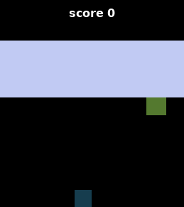
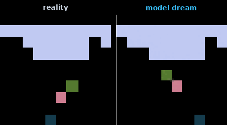
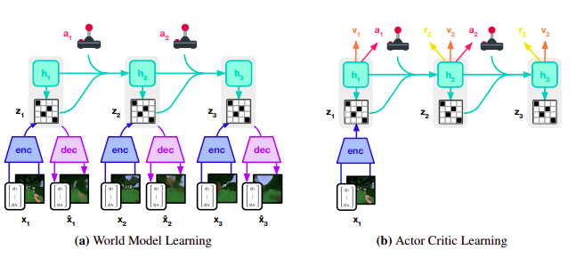
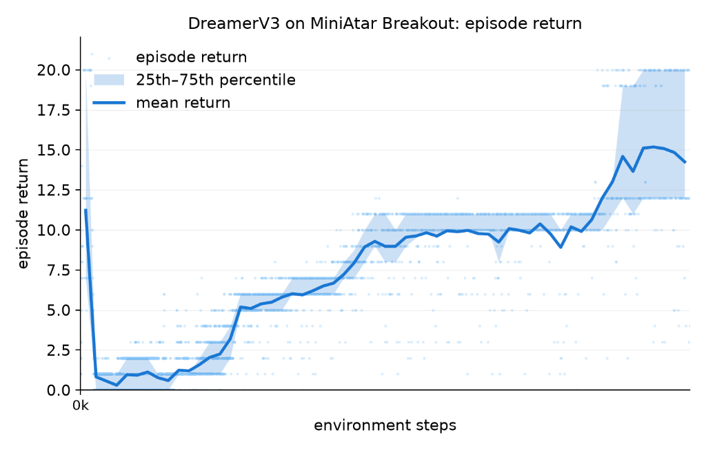
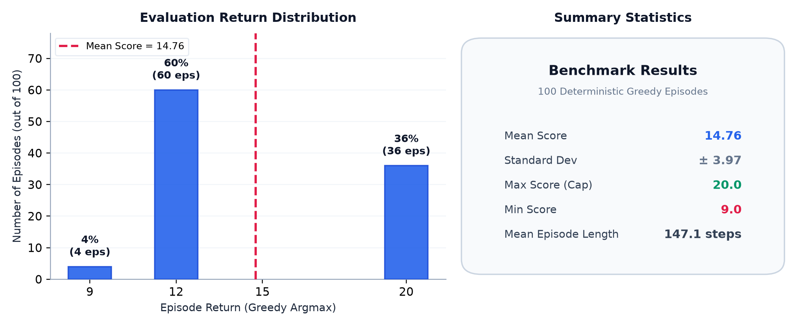
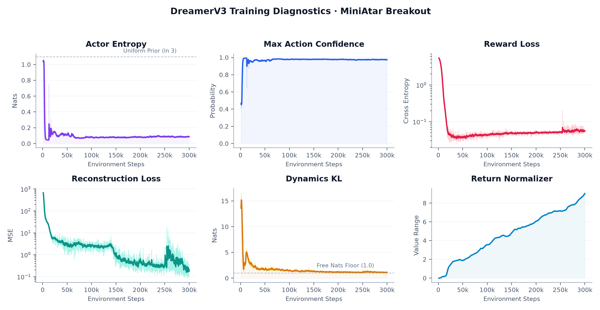

# DreamerV3 in Pure JAX

[](https://ojayballer.github.io/dreamerv3.html)

A from-scratch reimplementation of [DreamerV3](https://arxiv.org/abs/2301.04104) in JAX, Ninjax, and Flax. Built as a readable, single-purpose codebase: one training script, three source files, one config. The current hyperparameters follow the reference implementation defaults and the model is sized to the paper's 50M configuration. The codebase is designed to be readable and flexible for anyone working on world-model RL.

<p align="center">
  
  &nbsp;&nbsp;&nbsp;&nbsp;
  
</p>
<p align="center"><i>Left: trained agent playing Breakout with live episode score. Right: reality versus model imagination rollout.</i></p>

---

## Architecture

<p align="center">
  
</p>
<p align="center"><i>Figure: Hafner et al. (Nature, 2023). (a) World Model trains on raw sensory inputs. (b) Actor-Critic policy trains entirely inside the model's imagined latent rollouts.</i></p>

---

## Results

Validated on MiniAtar Breakout for 300,000 environment steps. Evaluated with a deterministic greedy argmax policy across 100 evaluation episodes.

| Metric | Value |
|---|---|
| **Mean Return** | **14.76** |
| Standard Deviation | ± 3.97 |
| Minimum Return | 9.0 |
| Maximum Return | 20.0 |
| Mean Episode Length | 147.1 steps |

### Learning Curve

<p align="center">
  
</p>

### Evaluation Distribution

<p align="center">
  
</p>

### Training Diagnostics

<p align="center">
  
</p>

---

## Project Structure

```
.
├── dreamerv3.yaml          # all hyperparameters in a single config
├── train.py                # training loop, unified loss, checkpointing
├── requirements.txt        # pinned environment
├── src/
│   ├── model.py            # RSSM, Encoder, Decoder, Actor, Critic, BlockGRU
│   ├── data.py             # gymnax vectorized environments, sequence buffer
│   └── utils.py            # symlog, two-hot encoding, lambda returns
└── results/
    └── Breakout-MinAtar/   # figures, GIFs, and evaluation logs
```

---

## Quick Start

```bash
pip install -r requirements.txt
python train.py
```

Environment and training parameters are configured via `dreamerv3.yaml`. To switch to another MinAtar game:

```yaml
env:
  task: 'Asterix-MinAtar'
```

### Environment Support & Extensibility

This codebase currently only supports **MinAtar** out of the box. The environment wrapper (`GymnaxVec`) and the sequence replay buffer in `src/data.py` are explicitly designed for MinAtar observation formats and rendering.

To use custom environments or other suites (like Atari, Crafter, or DM Control):
- **Replay Buffer & Task Wrapper (`src/data.py`)**: You will need to write a wrapper conforming to the step/reset interface and adapt the replay buffer storage tensors to match your environment's native observation shapes.
- **Actor Class (`src/model.py`)**: The `Actor` class is currently parameterized for discrete categorical action spaces. For continuous control (e.g. DM Control), you will need to modify the Actor head to output continuous distributions (e.g. squashed normal/tanh).

---

## References

1. Hafner, D., Pasukonis, J., Ba, J., & Lillicrap, T. (2023). [Mastering Diverse Domains through World Models](https://arxiv.org/abs/2301.04104). Nature.
2. Young, K. & Tian, T. (2019). [MinAtar: An Atari-Inspired Testbed for Thorough and Reproducible Reinforcement Learning Experiments](https://arxiv.org/abs/1903.03176).

---

## Citation

```bibtex
@software{kuseju2026dreamerv3jax,
  author       = {Omojire Kuseju},
  title        = {{DreamerV3} from Scratch in Pure {JAX}},
  year         = {2026},
  url          = {https://github.com/ojayballer/BeyondImagination}
}
```

---

## License

MIT
