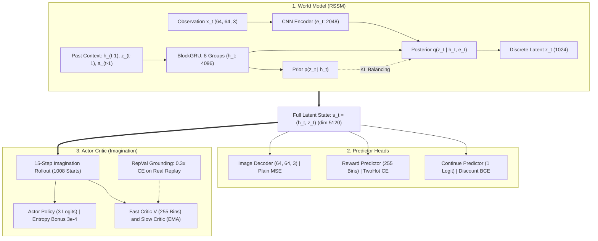

# DreamerV3 in Pure JAX

This repo is an implementation of DreamerV3 : 

A from-scratch reimplementation of [DreamerV3](https://arxiv.org/abs/2301.04104) in JAX, Ninjax, and Flax. Built as a readable, single-purpose codebase: one training script, three source files, one config. The current hyperparameters follow the reference implementation defaults and the model is sized to the paper's 50M configuration. The codebase is designed to be readable and flexible for anyone working on world-model RL.

<p align="center">
  
  &nbsp;&nbsp;&nbsp;&nbsp;
  
</p>
<p align="center"><i>Left: trained agent playing Breakout with live episode score. Right: reality versus model imagination rollout.</i></p>

---

## Architecture



---

## Results

Validated on MiniAtar Breakout for 300,000 environment steps. Evaluated with a deterministic greedy argmax policy across 100 evaluation episodes.

| Metric | Value |
|---|---|
| **Mean Return** | **14.76** |
| Standard Deviation | ± 3.97 |
| Minimum Return | 9.0 |
| Maximum Return | 20.0 |
| Mean Episode Length | 147.1 steps |

### Learning Curve

<p align="center">
  
</p>

### Evaluation Distribution

<p align="center">
  
</p>

### Training Diagnostics

<p align="center">
  
</p>

---

## Project Structure

```
.
├── dreamerv3.yaml          # all hyperparameters in a single config
├── train.py                # training loop, unified loss, checkpointing
├── requirements.txt        # pinned environment
├── src/
│   ├── model.py            # RSSM, Encoder, Decoder, Actor, Critic, BlockGRU
│   ├── data.py             # gymnax vectorized environments, sequence buffer
│   └── utils.py            # symlog, two-hot encoding, lambda returns
└── results/
    └── Breakout-MinAtar/   # figures, GIFs, and evaluation logs
```


---

## Quick Start

```bash
pip install -r requirements.txt
python train.py
```

Environment and training parameters are configured via `dreamerv3.yaml`. To switch to another environment:

```yaml
env:
  task: 'Asterix-MinAtar'
```

The default hyperparameters follow the reference implementation. For other environments, you may need to adjust `actent`, `lr`, or extend `steps` beyond 300k. Complex environments like Asterix require more environment steps for the actor policy to discover high-reward trajectories.

---

## References

1. Hafner, D., Pasukonis, J., Ba, J., & Lillicrap, T. (2023). [Mastering Diverse Domains through World Models](https://arxiv.org/abs/2301.04104). Nature.
2. Young, K. & Tian, T. (2019). [MinAtar: An Atari-Inspired Testbed for Thorough and Reproducible Reinforcement Learning Experiments](https://arxiv.org/abs/1903.03176).
3. Rodriguez-Sanchez, R. (2025). [DreamerV3 Pure JAX (Readable, Minimal)](https://github.com/rafarodsa/dreamer-v3-purejax).

---

## Citation

```bibtex
@software{kuseju2026dreamerv3jax,
  author       = {Omojire Kuseju},
  title        = {{DreamerV3} from Scratch in Pure {JAX}},
  year         = {2026},
  url          = {https://github.com/ojayballer/somnix}
}
```

---

## License

MIT